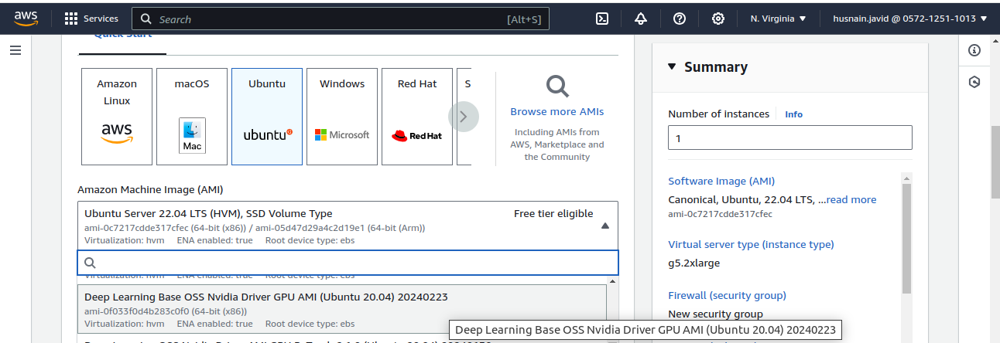
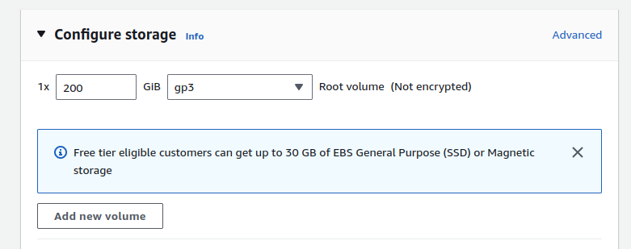
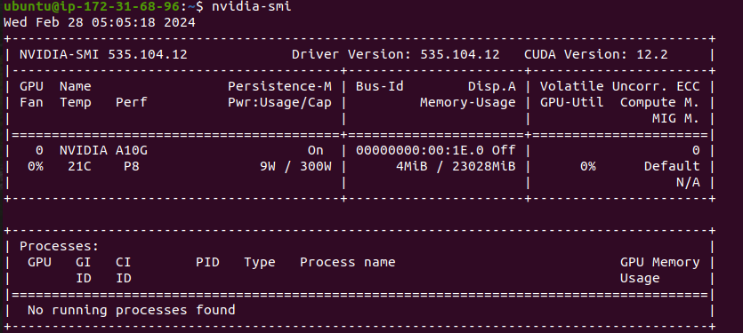
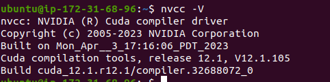
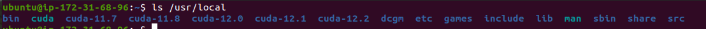

# Perfect365

# Project Overview

The aim of the project is to convert a single image into a 3D object, with target classes related to the fashion industry. For this purpose, DreamGaussian, One-2-3-4, and Stable DreamFusion are among the most commonly used Image-to-3D conversion models, offering results with higher accuracy compared to other models, with some limitations. The ultimate objective is to convert a single image into a 3D object with texture.

## Setup

### Setting up AWS Server for the Project

1. **Create an AWS Instance:**
   - Create an AWS `g5.2xlarge` instance.
   - Choose Ubuntu deep learning image OS as it comes with multiple CUDA versions.

    

2. **Storage Configuration:**
   - Increase storage from 75GB to 200GB as 3D models require large memory.

    

3. **SSH Connection:**
   - Launch the instance and establish an SSH connection from your terminal with the AWS instance.

4. **Checking CUDA and NVIDIA Driver Versions:**
   - Run `nvidia-smi` to check the Nvidia Driver version.
   
    

   - Run `nvcc -V` to check the current CUDA version.
   
    

   - To see all available CUDA versions, run `ls /usr/local`.
   
    

5. **Setting up CUDA 11.8:**
   - Setup paths for CUDA 11.8 in `.bashrc` file.

    ```bash
    echo 'export PATH=/usr/local/cuda-11.8/bin:$PATH' >> ~/.bashrc
    echo 'export LD_LIBRARY_PATH=/usr/local/cuda-11.8/lib64:$LD_LIBRARY_PATH' >> ~/.bashrc
    source ~/.bashrc
    ```

   - Change the Nvidia driver version to be compatible with CUDA 11.8 by running 
   ```bash
   sudo apt install nvidia-driver-515
   ```
   If you found any error, then run this:
   
   ```bash
   sudo apt install nvidia-driver-515 --fix-missing
   ```

6. **Installing cuDNN 8.7.0:**
   - Download cuDNN from the provided Google Drive link.
   ```angular2html
   https://drive.google.com/drive/folders/1ZivGV6wtsi92JIy8qnrt5VmWywzhNQyq?usp=sharing
    ```
   - Copy the downloaded file from your local to AWS server using `scp` command.
   ```bash
   scp -i /path/to/your/private-key.pem /path/to/your/local/cudnn-linux-x86_64-8.7.0.84_cuda11-archive.tar.xz ubuntu@your-server-ip:/path/on/server
   ```
   - Unzip the tar file using 
   ```bash
   sudo tar -xvf cudnn-linux-x86_64-8.7.0.84_cuda11-archive.tar.xz
   ```
   - Move the downloaded file and copy necessary files into the CUDA toolkit directory.
   ```bash
   sudo mv cudnn-linux-x86_64-8.7.0.84_cuda11-archive cuda
   ```
   ```bash
    sudo cp -P cuda/include/cudnn.h /usr/local/cuda-11.8/include
    sudo cp -P cuda/lib/libcudnn* /usr/local/cuda-11.8/lib64/
    sudo chmod a+r /usr/local/cuda-11.8/lib64/libcudnn*
   ```
   
   ```bash
   sudo reboot
   ```
7. **Verification:**
   - Verify the installation by running `nvidia-smi` and `nvcc -V`.

### Prerequisites

To set up this project, ensure you have the following:

- Miniconda
- CUDA v11.8
- cuDNN 8.7.0

#### Installing Miniconda

Download Miniconda using the following command:

```bash
curl -sL "https://repo.anaconda.com/miniconda/Miniconda3-latest-Linux-x86_64.sh" > "Miniconda3.sh"
```
Install Miniconda:
```bash
bash Miniconda3.sh
```
Now, reboot the server.
```bash
sudo reboot
```
Follow the prompts during the installation process, accepting all defaults. After installation, restart your Terminal. Your prompt should now indicate which environment is active (in this case, "base", i.e., the default environment).

### Create Environment
```bash
conda create -n DG python=3.10
conda activate DG
```
After creating the environment, setup `Pytorch`. Pytorch version 2.0.1 and cuda 11.8 works fine for our case.
```bash
pip install torch==2.0.1 torchvision==0.15.2 torchaudio==2.0.2 --index-url https://download.pytorch.org/whl/cu118
```

Note: If repo is not cloned, clone it first. And then go to repo. You can do this:
```bash
git clone https://github.com/perfect365-official/algoryc_2d_to_3d.git
```

If you have github repo, change directory to your repo directory:
```bash
cd algoryc_2d_to_3d
```

#### Install Requirements:
```bash
pip install -r requirements.txt
```


## Installing Dream Gaussian and Dependencies

The dependencies will be installed one by one.

```bash
cd dreamgaussian

pip install -r requirements.txt

# a modified gaussian splatting (+ depth, alpha rendering)
git clone --recursive https://github.com/ashawkey/diff-gaussian-rasterization
pip install ./diff-gaussian-rasterization

# simple-knn
pip install ./simple-knn

# nvdiffrast
pip install git+https://github.com/NVlabs/nvdiffrast/

# kiuikit
pip install git+https://github.com/ashawkey/kiuikit

cd ..
```

Note: If you want to run using Flask app (API), Go to ``Run App`` and follow those instructions, otherwise follow `Run Dream Gaussian from terminal` section.

### Run Dream Gaussian from terminal
If you want to run Dream Gaussian from terminal then you need to follow these steps. Otherwise, if you want to run using flask then, Go to ``Run App`` and follow those instructions.

Now, Image will be preprocessed first. The output will be `<image>_rgba.png`
```bash
# background removal and recentering, save rgba at 256x256
python dreamgaussian/process.py <image>.jpg

# save at a larger resolution
python dreamgaussian/process.py <image>.jpg --size 512
```


There are 2 stages to produce mesh from single image.
```bash
# Stage 1: training gaussian stage
python dreamgaussian/main.py --config dreamgaussian/configs/image.yaml input=<image>_rgba.png save_path=<output_path> elevation=0 force_cuda_rast=True

# Stage 2: training mesh stage
python dreamgaussian/main2.py --config dreamgaussian/configs/image.yaml input=<image>_rgba.png save_path=<output_path> elevation=0 force_cuda_rast=True
```

- ``input``: After preprocess step, `<image>_rgba.png` will be saved in the same path where input image is located. Provide that image here.
- ``save_path``: Provide path where you want to store 3D mesh.
- ``elevation``: If image is not front view, you can adjust elevation.

## Installing One-2-3-45 and Dependencies

Install Debian packages.
```bash
sudo apt update && sudo apt install git-lfs libsparsehash-dev build-essential
```

Install model dependencies.

```bash
cd One-2-3-45
pip install -r requirements.txt

# Install inplace_abn from source
git clone https://github.com/mapillary/inplace_abn.git
cd inplace_abn
python setup.py install
cd scripts
pip install -r requirements.txt
cd ../..

```

#### Install torchsparse:
```bash
FORCE_CUDA=1 pip install --no-cache-dir git+https://github.com/mit-han-lab/torchsparse.git@v1.4.0
```

Download model checkpoints.
```bash
python download_ckpt.py
```

Move to main directory
```
cd ..
```

Note: If you want to run using Flask app (API), Go to ``Run App`` and follow those instructions, otherwise follow `Run One-2-3-4 from terminal` section.

### Run One-2-3-4 from terminal
If you want to run One-2-3-45 from terminal then you need to follow these steps. Otherwise, if you want to run using flask then, Go to ``Run App`` and follow those instructions.
```bash
cd One-2-3-45
python run.py --img_path <input_image> --half_precision

# You can move to original directory using
cd ..
```
        
## Installing Stable Dream Fusion and Dependencies

```bash
cd stabledreamfusion
```

### Requirements
```bash
pip install -r requirements.txt

pip install git+https://github.com/NVlabs/tiny-cuda-nn/#subdirectory=bindings/torch

pip install git+https://github.com/openai/CLIP.git

pip install git+https://github.com/NVlabs/nvdiffrast/
```

### Download pre-trained models

Download pretrained weights for **Zero-1-to-3**

```bash
mkdir pretrained
cd pretrained

mkdir zero123
cd zero123

wget https://zero123.cs.columbia.edu/assets/zero123-xl.ckpt

cd ..
```

Download pretrained weights for **Omnidata**
```bash
mkdir omnidata
cd omnidata

# assume gdown is installed
gdown '1Jrh-bRnJEjyMCS7f-WsaFlccfPjJPPHI&confirm=t' # omnidata_dpt_depth_v2.ckpt
gdown '1wNxVO4vVbDEMEpnAi_jwQObf2MFodcBR&confirm=t' # omnidata_dpt_normal_v2.ckpt

cd ../../..
```

### Build extension (optional)
```bash
cd stabledreamfusion

# install all extension modules
bash scripts/install_ext.sh

# if you want to install manually, here is an example:
pip install ./raymarching # install to python path (you still need the raymarching/ folder, since this only installs the built extension.)
```

Note: If you want to run using Flask app (API), Go to ``Run App`` and follow those instructions, otherwise follow `Run Stable-DreamFusion from terminal` section.

### Run Stable-DreamFusion from terminal
If you want to run Stable-DreamFusion from terminal then you need to follow these steps. Otherwise, if you want to run using flask then, Go to ``Run App`` and follow those instructions.

First preprocess input image
```bash
python stabledreamfusion/preprocess_image.py <image>.png
```

Now, run this to generate 3D mesh:
```bash
python stabledreamfusion/main.py -O --image <image>_rgba.png --workspace <name_of_output_directory> --iters 5000 --save_mesh --batch_size 2
```
- ``--image``: After preprocess step, `<image>_rgba.png` will be saved in the same path where input image is located. Provide that image here.
- ``--workspace``: Provide path where you want to store 3D mesh.
- ``--iter``: Default is 5000. Increasing iterations can improve results while decreasing iterations will provide bad results.
- ``--save_mesh``: Mesh will be stored if this flag is provided. Otherwise, it does not store mesh by default.
- ``--batch_size``: It can improve results but will require more computational power. Deafult is 1.


## Run App
```bash
python3 flask_app.py
```

- After running the above command you will get local host address with port number like `http://127.0.0.1:5000`. 
- Click on that, a webpage will appear. 
- Dream Gaussian and Stable-DreamFusion have different compatibility versions for `pymeshlab`. The model you want to run, first install dependencies for that model by clicking on the respective button.
- Upload image (Allowed extensions are .png, .jpg, .jpeg)
- After image is uploaded, click on the button to run the model.
- After the process will be finished successfully, 'Download Result' link will appear under the button.
- Click on that, Zip file will be saved. 

## Dependency issue
Dream Gaussian and Stable-DreamFusion are compatible on different versions of `pymeshlab`. 
If you have any issue there, solve that by installing following version of pymeshlab for the respected models.

**For Stable-DreamFusion**

```bash
pip install -U pymeshlab==2022.2.post4
```

**For Dream Gaussian**

```bash
pip install -U pymeshlab
```

## Warning Issue
If there is some warning or error related to ``onnxruntime``, this is because of onnxruntime version (although without handling this warning, it would also work fine). But you can handle this by installing following version of ``onnxruntime``:

```bash
pip install onnxruntime==1.16.0
```
